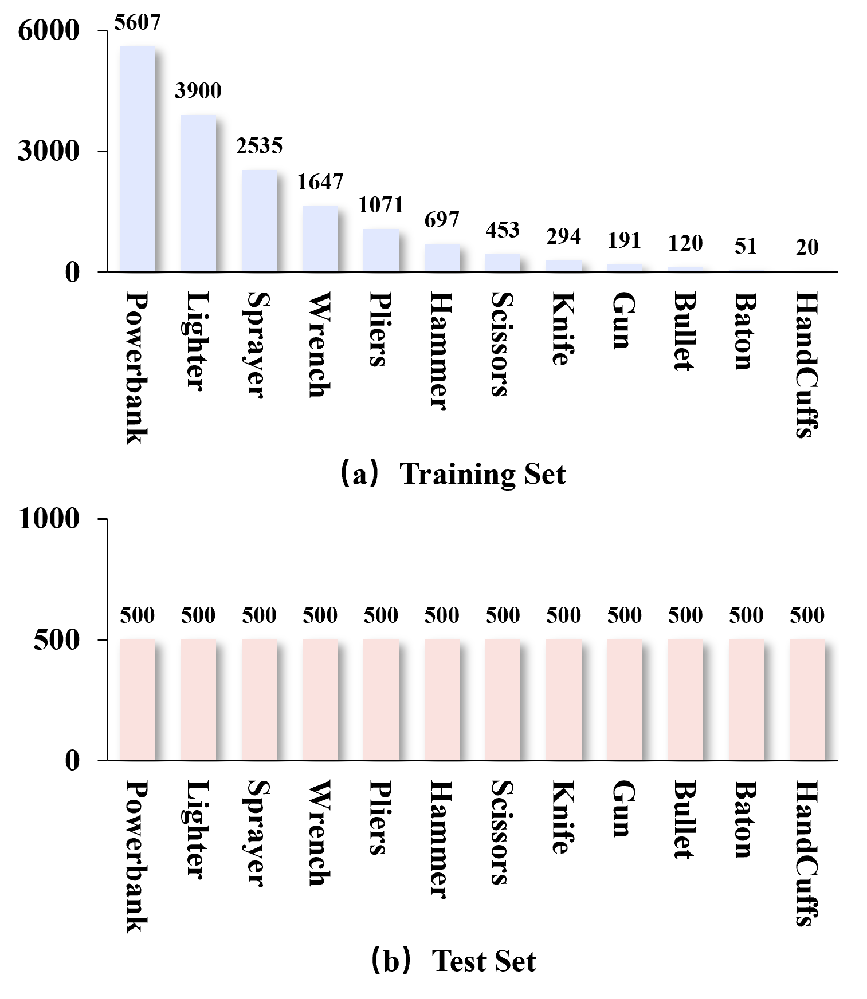

# LTXRay
## INTRODUCTION
LTXRay consists of 18,718 images from 12 common classes, with $20 \sim 5,607$ instances per class labeled with bounding-box annotations. Notably, the imbalance factor of entire dataset reaches 280.35. To the best of our knowledge, LTXRay is the first benchmark dedicated to the task of long-tailed prohibited item detection.

## DOWNLOAD
百度网盘：https://pan.baidu.com/s/1wkX2RIYQU6bVMOt3106TFg?pwd=74if 提取码: 74if

## Citation
If you use this benchmark in your research, please cite this project. 
@ARTICLE{11202210, 
  &emsp;&emsp;author={Wang, Boying and Zhang, Fuwei and Fang, Xiangfei and Ji, Ruyi and Tao, Renshuai and Cao, Yaming and Liu, Bo and Liu, Jing}, 
  &emsp;&emsp;journal={IEEE Transactions on Information Forensics and Security},  
  &emsp;&emsp;title={Exploring X-ray Prohibited Item Detection From Long-Tailed Learning Perspective},  
  &emsp;&emsp;year={2025}, 
  &emsp;&emsp;doi={10.1109/TIFS.2025.3620642}}
## LICENSE
The images and the corresponding annotations in LTXRay Dataset can be used ONLY for academic purposes, NOT for commercial purposes.

Copyright © Shanxi Key Laboratory of Machine Vision and Virtual Reality, North University of China. All rights reserved.
